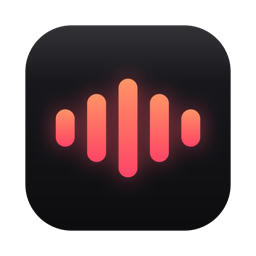

<div align="center">



# Sotto

**Hold a key. Speak. Your words appear, anywhere.**

Push-to-talk dictation for macOS. Fully on-device.


<picture>
  <source media="(prefers-color-scheme: dark)" srcset="docs/assets/hud-dark.png">
  
</picture>

</div>

Hold the shortcut (default **Right ⌥**), speak, release. The transcript is cleaned up and typed into whatever app has focus.

- Transcription runs on Apple's on-device `SpeechAnalyzer`. No network code in the app.
- Pre-warmed pipeline: ~55 ms to start listening, ~20 MB of memory.
- Text is inserted by synthetic typing, so it works in web editors and terminals and never touches your clipboard.
- Record any shortcut in Settings: a modifier, an F-key, or a combo like ⌥Space.
- Removes filler words, fixes capitalization, and a personal dictionary keeps your jargon right.

## Install

1. Download `Sotto.zip` from the [latest release](https://github.com/H4ck3r-x0/sotto/releases/latest) and unzip it.
2. Drag **Sotto.app** into your **Applications** folder.
3. Open it. macOS will say it "could not verify Sotto is free of malware": click **Done**, then go to **System Settings → Privacy & Security**, scroll down, and click **Open Anyway**. This happens once, because the app is not notarized by Apple.
4. Grant **Microphone** and **Accessibility** when asked. That's it: hold Right ⌥ and talk.

Requires macOS 26 or later on Apple silicon.

## Building from source

```sh
brew install xcodegen
xcodegen
xcodebuild -project Sotto.xcodeproj -scheme Sotto -configuration Release -derivedDataPath build build
cp -R build/Build/Products/Release/Sotto.app /Applications/
```

Re-run `xcodegen` after adding or removing source files.

## Tips

- **Dictionary**: Settings → Dictation → Edit Dictionary…, one rule per line: `x code → Xcode`.
- **Globe key switches language instead?** System Settings → Keyboard → "Press Globe key to: **Do Nothing**".
- **Debug log**: `defaults write app.sotto.Sotto debugLogging -bool YES`, then run the binary from a terminal.

Curious how it works? Read the [architecture notes](docs/ARCHITECTURE.md).

<div align="center">
<sub><a href="LICENSE">MIT License</a></sub>
</div>
