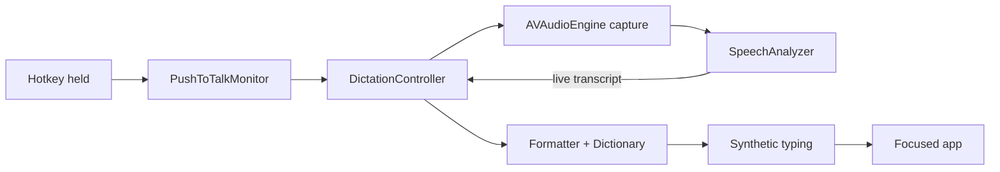

# Architecture

About 1,600 lines of Swift 6 around one state machine.



`DictationController` (`Core/`) is the single `@Observable` state machine: `idle → recording → transcribing → idle`. The menu bar icon, HUD, and Settings just observe it.

## Key decisions

- **Pre-warming makes it instant.** The next `SpeechAnalyzer` session and the `AVAudioEngine` are built at idle; a key press only consumes them. ~55 ms to capture, ~20 MB footprint.
- **Release finalizes, never cancels.** Releasing the key only stops audio; the analyzer finishes naturally and delivers the transcript. Cancelling it loses everything.
- **Two hotkey paths.** Modifier-only keys use `NSEvent` `.flagsChanged` monitors (tracking the specific key code, since the flag cannot tell Right ⌥ from Left ⌥). Key-based shortcuts (F13, ⌥Space) use a `CGEventTap` that swallows the key while held. Bare letter keys are refused at record time.
- **Synthetic typing won.** AX insertion silently fails in web editors and terminals; paste-restore races custom editors (X's composer). `CGEventKeyboardSetUnicodeString` in ≤20-unit chunks works everywhere and leaves the clipboard alone. ⌘V paste stays as an option.

## Swift 6 traps hit

The project uses `SWIFT_DEFAULT_ACTOR_ISOLATION: MainActor`:

- Closures called from audio or event-tap threads must be `@Sendable`, or they crash at runtime (`dispatch_assert_queue_fail`).
- The `CGEventTap` C callback is a `nonisolated static` that re-enters with `MainActor.assumeIsolated` (safe: the tap runs on the main run loop). `CGEvent` is not `Sendable`, so only the swallow-or-pass decision crosses.
- Audio buffers hand off through a `nonisolated` relay and `-> sending` returns.

## Layout

```
Sotto/
├── App/            Entry point + composition root
├── Core/           DictationController, Hotkey
├── Services/       Audio, Transcription, TextFormatting, PushToTalk,
│                   TextInsertion, Feedback, Permissions
├── Support/        Info.plist, entitlements, gated logging
├── Resources/      Icon, accent color
└── UI/             MenuBar, HUD, Settings
```

The `.xcodeproj` is generated by XcodeGen from `project.yml`; re-run `xcodegen` after adding files.
